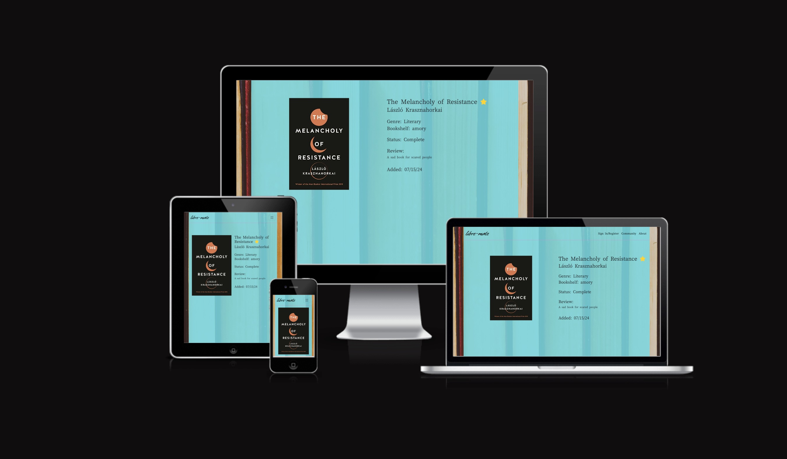
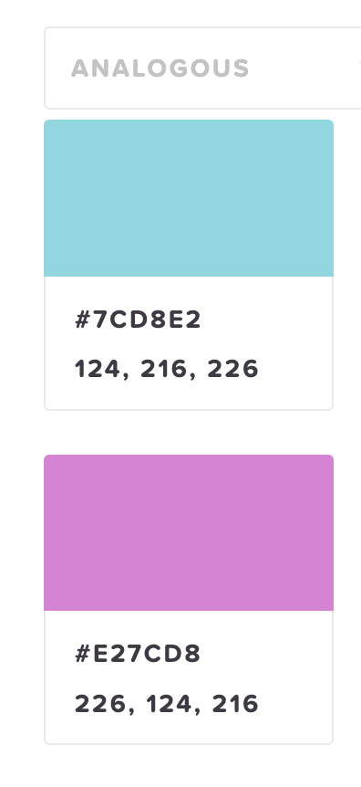
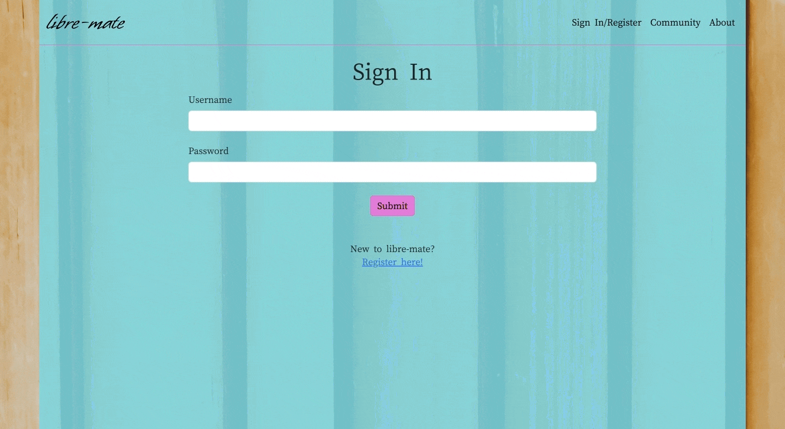
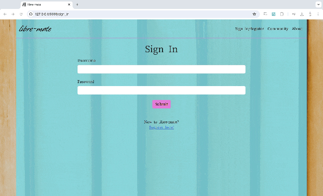
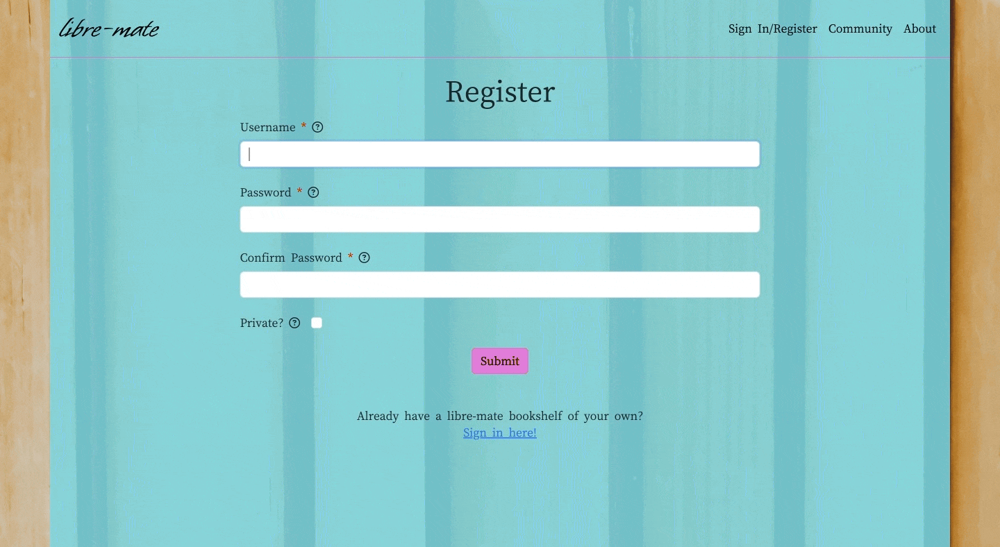
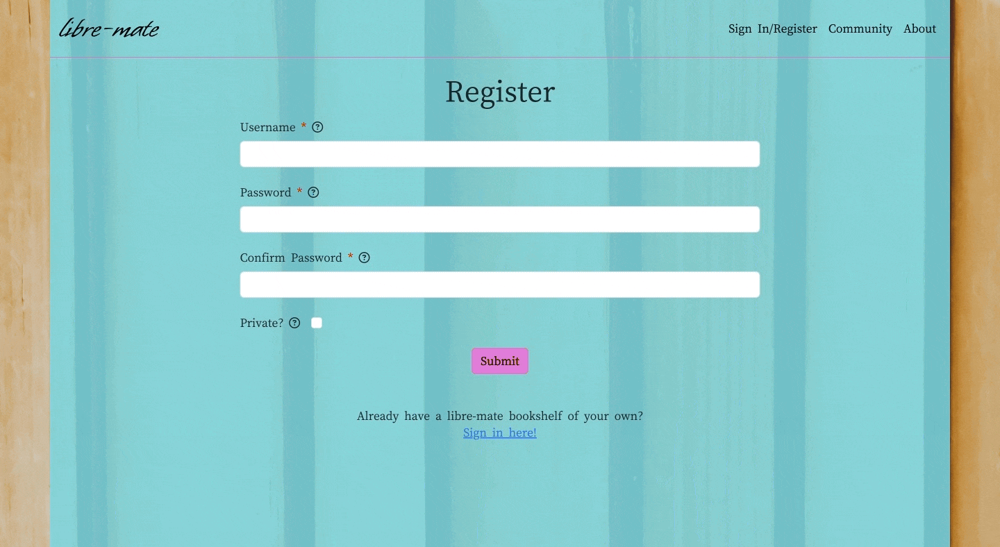

# libre-mate: an online book club

Developed by Benedict Amory Chambers
## Table of Contents

1. [Project Goals](#project-goals)
    1. [User Goals](#user-goals)
    2. [Site Goals](#site-goals)
2. [User Experience](#user-experience)
    1. [Target Audience](#target-audience)
    2. [User Stories](#user-stories)
3. [Design](#design)
    1. [Design Choices](#design-choices)
    2. [Colours](#colours)
    3. [Fonts](#fonts)
    4. [Structure](#structure)
    5. [Wireframes](#wireframes)
4. [Technologies](#technologies)
    1. [Languages](#languages)
    2. [Frameworks and Tools](#frameworks-and-tools)
5. [Features](#features)
6. [Testing](#testing)
    1. [HTML Validation](#HTML-validation)
    2. [CSS Validation](#CSS-validation)
    3. [JavaScript Validation](#javascript-validation)
    4. [Python Validation](#python-validation)
    4. [Accessibility](#accessibility)
    5. [Performance](#performance)
    6. [Compatibility](#compatibility)
    7. [Testing user stories](#testing-user-stories)
7. [Bugs](#bugs)
8. [Credits](#credits)
9. [Deployment](#deployment)
10. [Acknowledgements](#acknowledgements)

## Project Goals 

This is a community-focused online library where users can create their own customised bookshelf with full database CRUD functionality; a user can decide to make their content private, but there is a community tab for sharing books and thoughts with other readers that may encourage them to buy and read something new.

### User Goals 

- A simple, clear, visually appealing way to catalogue and store their library online
- A space to preserve their thoughts about a book and to read others' thoughts
- Full control over their own content and data that has been stored in the database, in terms of privacy and in editability 

### Site Goals

- A clear and easy-to-navigate layout for all information
- An accessible and responsive site that ensures an equally good experience regardless of how the user wants to interact with the site
- Efficient, useful data management and access, providing a valuable resource for users
- Option to monetise the site by use of referral links to buy books from user recommendations

### Developer Goals

- Create a site that allows users to easily and intuitively interact with a database
- Design the site to make valuable and enjoyable use of the data provided by users
- The site is accessible to a wide range of users, with a clear and easy-to-navigate structure for all information
- Customise the experience to appeal to the target demographic and to foster a sense of community

## User Experience

### Target Audience

- Readers and book enthusiasts
- Bloggers and reviewers
- Authors who may be interested in having their books reviewed on the site

### User Stories

#### First Time User

1. Find out what the site has to offer and who it is for
2. Easily navigate around the site; access the Register, Community, and About pages
3. Register for a new account
4. Create their own genre tags to organise their books
5. Create new books in their library
6. Contribute to the community tab
7. Buy a book through the community tab based on a user's recommendation
8. Sign out of their account

#### Returning User

9. Log back into their account
10. View their books and sort them by different categories
11. Edit the details of a book entry
12. Edit the name of a genre tag
13. Delete a book from their library
14. Easily save their associated books before deleting a custom genre tag
15. Delete a custom genre tag from their database
16. Switch from a public to a private account or vice versa
17. Manage their account
18. Delete their account and all associated data

#### Site Owner:

19. Highlight a variety of public user reviews that can direct users to referral purchase links
20. Provide users with an accessible, convenient, secure database to store their thoughts about their book collections

## Design 

### Design Choices

I have opted for as simple and uncluttered a design as possible, drawing the attention more solely to the books on display. I have used a translucent overlay for all site content, on top of a background image that conveys the theme and tone of the site's design. By keeping the content within a relaxed, flat colour background, I intended to make both the content and the way that users can interact with the content clearer and more intuitive.

### Colours

I used [HTML Color Codes](https://htmlcolorcodes.com/color-picker/) to choose two analogous complementary colours for both the primary background and accent colours.

### Fonts

I used two fonts on the website; one of which I used for custom book titles and for the main brand imagelink present in the header of every page, which is a display font conveying a literary tone, and one clearer font for any body of text on the site, which is easier and clearer to read.

[Whisper](https://fonts.google.com/specimen/Whisper) - Display font

[Cactus Classical Serif](https://fonts.google.com/specimen/Cactus+Classical+Serif) - Main text font

### Structure

The site consists of eight main pages with several supplementary pages for clear functionality.

1. My Library - This is the homepage for logged in users. It displays the user's books, which can be sorted by several different datapoints, and allows the user to add new books or genre tags to their library. This page links to two supplementary pages, with forms to submit new books and genre names to the database.

2. View Book - Each book in the user's library can be viewed individually for visual clarity and to see further information. This page links to one supplementary page, which is a form the user can submit to edit the data associated with this book in the database.

3. Community - This page focuses on the community building aspect of the site. It displays the most recent entries and reviews created by users, as long as the user has a public account. This is where users can see what other people are reading, and read the thoughts they have posted on the book, potentially leading to referral link sales.

4. Register - A form for the creation of a new user in the database, with the option to choose a private or public account. This page links to the Sign In page for users who already have an account.

5. Sign In - A form that allows users to log in to their account. This page links to the Register page for users that do not yet have their own account.

6. Account - This page allows users to manage their account. Here, they can edit or delete their own custom genre tags, can switch between a public and private account, and can delete their account and all related data entirely if they wish.

7. About - A short page explaining the site's ethos and goals to the user.

8. 404 - A custom 404 page redirecting the user to either their own library or to the Sign In page when navigating to an unknown URL.

### Wireframes

Wireframes created in Balsamiq

## Technologies

### Languages 

HTML5

CSS3

JavaScript

Python

Jinja2

### Frameworks and Tools

[Flask](https://flask.palletsprojects.com/en/3.0.x/)

I built this web application in Flask, in order to make use of templating and to use Python on the backend for accessing and manipulating the database.

[Flask Blueprint](https://flask.palletsprojects.com/en/3.0.x/blueprints/)

[SQLAlchemy](https://www.sqlalchemy.org/)

I used the SQLAlchemy ORM to write efficient, clean Pythonic code for manipulating the database.

[EDrawMax](https://www.edrawmax.com/online/en/)

I used this tool to develop an Entity Relationship Diagram during the planning stages of my project.

[Open Library Covers API](https://openlibrary.org/dev/docs/api/covers)

This API provides cover images of books from their database, using an ISBN provided by the user. 

[Bootstrap](https://getbootstrap.com/)

[Visual Studio Code](https://code.visualstudio.com/)

[Git](github.com)

[Heroku](heroku.com)

[Google Fonts](https://fonts.google.com/)

[Balsamiq](https://balsamiq.com/)

[Obsidian](https://obsidian.md/)

[Font Awesome](https://fontawesome.com/)

[Favicon](https://favicon.io/)

[W3C Markup Validation Service](https://validator.w3.org/)

[W3C CSS Validation Service](https://jigsaw.w3.org/css-validator/)

[JSLint](https://www.jslint.com/)

[CI Python Linter](https://pep8ci.herokuapp.com/)

[WebAIM Contrast Checker](https://webaim.org/resources/contrastchecker/)

[WAVE Web Accessibility Evaluation Tools](https://wave.webaim.org/)

## Features

### Header and Navigation

- The navigation bar is present at the top of every page to allow intuitive and easy navigation
- The navbar collapses into a convenient hamburger menu on smaller screen sizes
- The navbar displays different options for logged in users and guests, directing guests to site info and registration, and providing logged in users with access to their library and account

User Stories: 1, 2, 8, 17

### Sign In and Registration

- Sign In and Registration pages use similar, simple forms to allow users to create a new account entry in the database and to access an account they have already created
- Tooltips on each registration element to explain the requirements for each
- Easy option to create private or public account with explanation for what this means
- Form validation to ensure there are no duplicate usernames in the database
- Custom validation messages to direct the user upon attempting to submit invalid input
- Custom form validation to ensure appropriate data is entered into database

User Stories: 3, 9

### Sign Out

- Logs a user out of their account and prevents further access to their data without first logging in again

User Stories: 8, 20

### My Library

- Displays a users book collection responsively based on screen size for a visually clear, accessible, enjoyable experience
- Allows users to search their library by title and author names
- The user can add new books and new genres using the prominent buttons on this page

User Stories: 4, 5, 6, 10, 20

### Cover Image API

- When adding a book, user can enter an ISBN that will attempt to fetch the book's cover art using the Open Library Covers API
- User has option to confirm or reject the cover image found using the ISBN provided
- Tooltip and custom form validation message instructs the user on correct input if the API does not return a successful result or if incorrect input is entered
- If user does not enter an ISBN to search for a cover image, or if the cover image provided is not correct, the site generates a simple consistent custom book cover with the title in a display font

User Stories: 5, 11

### Sort

- Users can sort their collection by book title, by author name, by genre, by status, and by the date the entries were added

User Stories: 10

### View Book

- Individual book view displays further information about the entry and displays the user's review, if it exists
- If the book being viewed belongs to the logged in user, allows them the option to edit the details of the entry or delete the entry entirely
- If the book is not owned by the logged in user, or is viewed by a guest, removes the options to update the data
- If the user is private, only displays the book and further info for the entry's owner when logged in

User Stories: 2, 10, 11, 12, 13

### Community

- Displays public user reviews, staring with the most recent, broken down into shorter pages with a pagination tab for less cluttered and more easily digested reading for the user
- Referral links for each book in the community tab 

User Stories: 2, 6, 7, 19

### Account 

- User can view their account settings and easily switch from public to private or from private to public
- See all genres owned by the user, with the option to edit the genre names
- Option to delete a custom genre; additional option in the confirmation modal before deleting to easily switch over each book currently under that genre to the default 'Misc', so that the entries are preserved, or to simply delete the genre along with all associated books 
- User can delete their account and all associated data here, with a confirmation modal and custom coded checkbox to ensure account is not deleted by mistake

User Stories: 12, 14, 15, 16, 17, 18

### About

- Clear description of the site's goals and the ethos behind the design

User Stories: 1, 20

### 404

- Custom 404 page that redirects guest users to the Sign In/Register page and redirects logged in users back to their library

User Stories: 2, 20

## Testing

### HTML Validation

### CSS Validation

### JavaScript Validation

### Python Validation

### Accessibility

### Performance

### Compatibility

### Testing User Stories

#### First-Time User

As a first-time user, I want to:

1. Find out what the site has to offer and who it is for

| **Feature** | **Action** | **Expected Result** | **Actual Result** |
| ---- | ---- | ---- | ---- |
| About | Navigate to About Page | Presented with information about the site | Works as expected |

Screen Capture

2. Easily navigate around the site; access the Register, Community, and About pages

| **Feature** | **Action** | **Expected Result** | **Actual Result** |
| ---- | ---- | ---- | ---- |
| Header and Navigation | Select pages from navbar | All links direct to the correct page | Works as expected |

Screen Capture

| **Feature** | **Action** | **Expected Result** | **Actual Result** |
| ---- | ---- | ---- | ---- |
| 404 | Navigate to unknown page | Custom 404 page redirects to homepage | Works as expected |

Screen Capture

3. Register for a new account

| **Feature** | **Action** | **Expected Result** | **Actual Result** |
| ---- | ---- | ---- | ---- |
| Sign In and Registration | Submit registration form | Site signs in newly created user from database | Works as expected |
| Tooltips | Hover over tooltip icon | Popup provides further information about requirements | Works as expected |

Screen Capture

### Testing User Input

## Bugs

## Credits

### Media

### External Code

## Deployment

## Acknowledgements