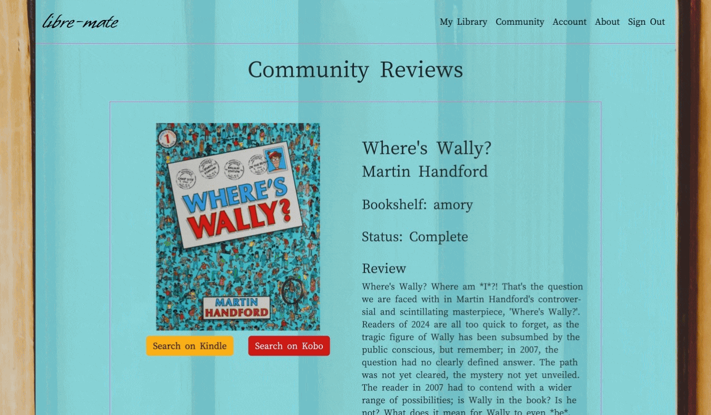
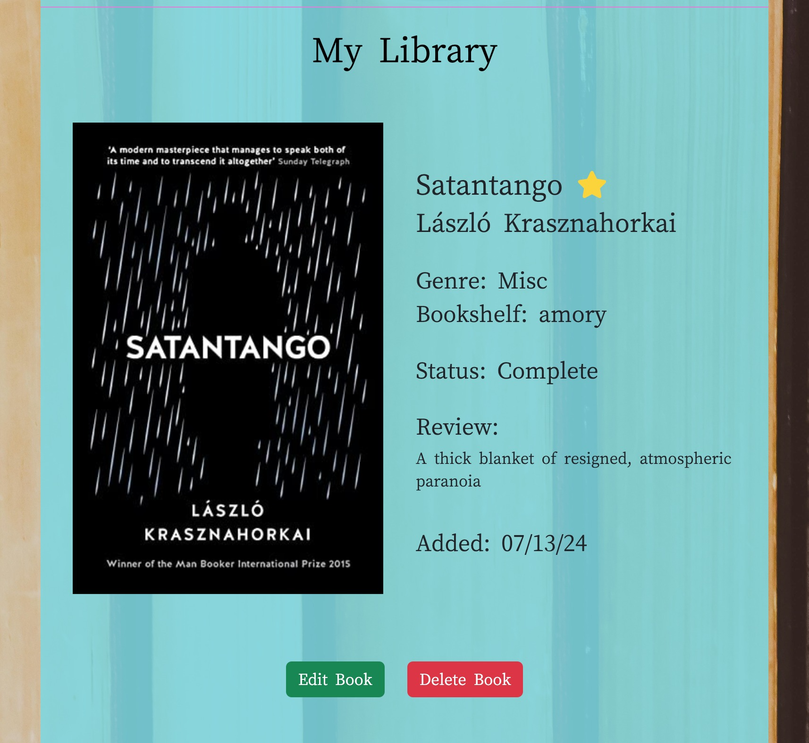
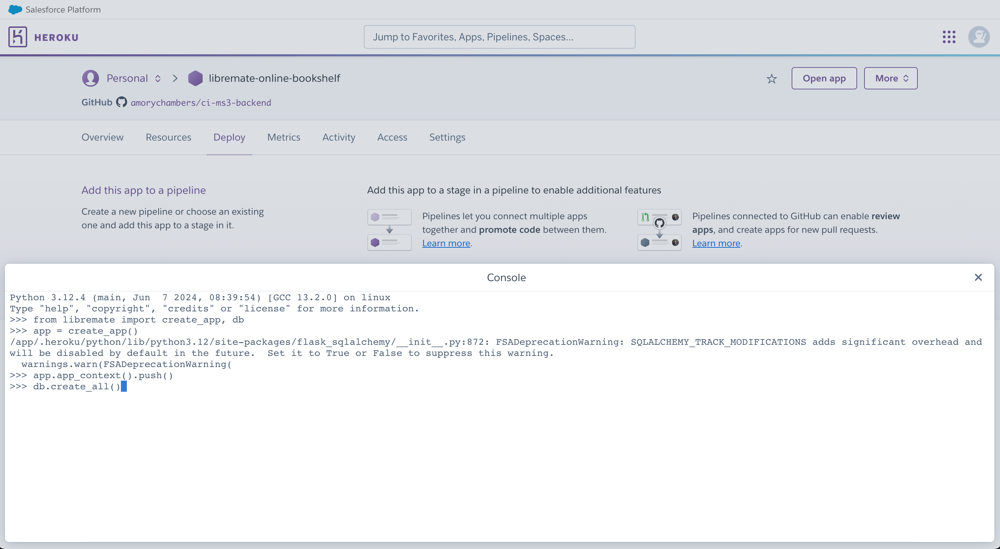

# libre-mate: an online book club


Developed by Benedict Amory Chambers
## Table of Contents

1. [Project Goals](#project-goals)
    1. [User Goals](#user-goals)
    2. [Site Goals](#site-goals)
2. [User Experience](#user-experience)
    1. [Target Audience](#target-audience)
    2. [User Stories](#user-stories)
3. [Design](#design)
    1. [Design Choices](#design-choices)
    2. [Colours](#colours)
    3. [Fonts](#fonts)
    4. [Structure](#structure)
    5. [Wireframes](#wireframes)
4. [Technologies](#technologies)
    1. [Languages](#languages)
    2. [Frameworks and Tools](#frameworks-and-tools)
5. [Features](#features)
6. [Testing](#testing)
    1. [HTML Validation](#HTML-validation)
    2. [CSS Validation](#CSS-validation)
    3. [JavaScript Validation](#javascript-validation)
    4. [Python Validation](#python-validation)
    4. [Accessibility](#accessibility)
    5. [Performance](#performance)
    6. [Compatibility](#compatibility)
    7. [Testing user stories](#testing-user-stories)
7. [Bugs](#bugs)
8. [Credits](#credits)
9. [Deployment](#deployment)
10. [Acknowledgements](#acknowledgements)

## Project Goals 

This is a community-focused online library where users can create their own customised bookshelf with full database CRUD functionality; a user can decide to make their content private, but there is a community tab for sharing books and thoughts with other readers that may encourage them to buy and read something new.

### User Goals 

- A simple, clear, visually appealing way to catalogue and store their library online
- A space to preserve their thoughts about a book and to read others' thoughts
- Full control over their own content and data that has been stored in the database, in terms of privacy and in editability 

### Site Goals

- A clear and easy-to-navigate layout for all information
- An accessible and responsive site that ensures an equally good experience regardless of how the user wants to interact with the site
- Efficient, useful data management and access, providing a valuable resource for users
- Option to monetise the site by use of referral links to buy books from user recommendations

### Developer Goals

- Create a site that allows users to easily and intuitively interact with a database
- Design the site to make valuable and enjoyable use of the data provided by users
- The site is accessible to a wide range of users, with a clear and easy-to-navigate structure for all information
- Customise the experience to appeal to the target demographic and to foster a sense of community

## User Experience

### Target Audience

- Readers and book enthusiasts
- Bloggers and reviewers
- Authors who may be interested in having their books reviewed on the site

### User Stories

#### First Time User

1. Find out what the site has to offer and who it is for
2. Easily navigate around the site; access the Register, Community, and About pages
3. Register for a new account
4. Create their own genre tags to organise their books
5. Create new books in their library
6. Contribute to the community tab
7. Buy a book through the community tab based on a user's recommendation
8. Sign out of their account

#### Returning User

9. Log back into their account
10. View their books and sort them by different categories
11. Edit the details of a book entry
12. Edit the name of a genre tag
13. Delete a book from their library
14. Easily save their associated books before deleting a custom genre tag
15. Delete a custom genre tag from their database
16. Switch from a public to a private account or vice versa
17. Delete their account and all associated data

#### Site Owner:

18. Highlight a variety of public user reviews that can direct users to referral purchase links
19. Provide users with an accessible, convenient, secure database to store their thoughts about their book collections

## Design 

### Design Choices

I have opted for as simple and uncluttered a design as possible, drawing the attention more solely to the books on display. I have used a translucent overlay for all site content, on top of a background image that conveys the theme and tone of the site's design. By keeping the content within a relaxed, flat colour background, I intended to make both the content and the way that users can interact with the content clearer and more intuitive.

### Colours

I used [HTML Color Codes](https://htmlcolorcodes.com/color-picker/) to choose two analogous complementary colours for both the primary background and accent colours.


### Fonts

I used two fonts on the website; one of which I used for custom book titles and for the main brand imagelink present in the header of every page, which is a display font conveying a literary tone, and one clearer font for any body of text on the site, which is easier and clearer to read.

[Whisper](https://fonts.google.com/specimen/Whisper) - Display font

[Cactus Classical Serif](https://fonts.google.com/specimen/Cactus+Classical+Serif) - Main text font

### Structure

The site consists of eight main pages with several supplementary pages for clear functionality.

1. My Library - This is the homepage for logged in users. It displays the user's books, which can be sorted by several different datapoints, and allows the user to add new books or genre tags to their library. This page links to two supplementary pages, with forms to submit new books and genre names to the database.

2. View Book - Each book in the user's library can be viewed individually for visual clarity and to see further information. This page links to one supplementary page, which is a form the user can submit to edit the data associated with this book in the database.

3. Community - This page focuses on the community building aspect of the site. It displays the most recent entries and reviews created by users, as long as the user has a public account. This is where users can see what other people are reading, and read the thoughts they have posted on the book, potentially leading to referral link sales.

4. Register - A form for the creation of a new user in the database, with the option to choose a private or public account. This page links to the Sign In page for users who already have an account.

5. Sign In - A form that allows users to log in to their account. This page links to the Register page for users that do not yet have their own account.

6. Account - This page allows users to manage their account. Here, they can edit or delete their own custom genre tags, can switch between a public and private account, and can delete their account and all related data entirely if they wish.

7. About - A short page explaining the site's ethos and goals to the user.

8. 404 - A custom 404 page redirecting the user to either their own library or to the Sign In page when navigating to an unknown URL.

### Wireframes

Wireframes created in Balsamiq

## Technologies

### Languages 

HTML5

CSS3

JavaScript

Python

Jinja2

### Frameworks and Tools

[Flask](https://flask.palletsprojects.com/en/3.0.x/)

I built this web application in Flask, in order to make use of templating and to use Python on the backend for accessing and manipulating the database.

[Flask Blueprint](https://flask.palletsprojects.com/en/3.0.x/blueprints/)

[flask-unittest](https://github.com/TotallyNotChase/flask-unittest)

I used flask-unittest to write a test suite for all database interactions

[SQLAlchemy](https://www.sqlalchemy.org/)

I used the SQLAlchemy ORM to write efficient, clean Pythonic code for manipulating the database.

[EDrawMax](https://www.edrawmax.com/online/en/)

I used this tool to develop an Entity Relationship Diagram during the planning stages of my project.

[Open Library Covers API](https://openlibrary.org/dev/docs/api/covers)

This API provides cover images of books from their database, using an ISBN provided by the user. I decided to use this API instead of allowing the users to submit image urls to the database, for the sake of a consistent visual theme, and of ensuring that the images displayed were actual book covers and thus appropriate to the site. Additionally, I respect the work of Open Library tremendously and wanted to use their database of book covers. 

[Bootstrap](https://getbootstrap.com/)

[Visual Studio Code](https://code.visualstudio.com/)

[Git](github.com)

[Heroku](heroku.com)

[Google Fonts](https://fonts.google.com/)

[Balsamiq](https://balsamiq.com/)

[Obsidian](https://obsidian.md/)

[Font Awesome](https://fontawesome.com/)

[Favicon](https://favicon.io/)

[W3C Markup Validation Service](https://validator.w3.org/)

[W3C CSS Validation Service](https://jigsaw.w3.org/css-validator/)

[JSLint](https://www.jslint.com/)

[CI Python Linter](https://pep8ci.herokuapp.com/)

[WebAIM Contrast Checker](https://webaim.org/resources/contrastchecker/)

[WAVE Web Accessibility Evaluation Tools](https://wave.webaim.org/)


## Features

### Header and Navigation

- The navigation bar is present at the top of every page to allow intuitive and easy navigation
- The navbar collapses into a convenient hamburger menu on smaller screen sizes
- The navbar displays different options for logged in users and guests, directing guests to site info and registration, and providing logged in users with access to their library and account

User Stories: 1, 2, 8, 17


### Sign In and Registration

- Sign In and Registration pages use similar, simple forms to allow users to create a new account entry in the database and to access an account they have already created
- Tooltips on each registration element to explain the requirements for each
- Easy option to create private or public account with explanation for what this means
- Form validation to ensure there are no duplicate usernames in the database
- Custom validation messages to direct the user upon attempting to submit invalid input
- Custom form validation to ensure appropriate data is entered into database

User Stories: 3, 9


### Sign Out

- Logs a user out of their account and prevents further access to their data without first logging in again

User Stories: 8, 20


### My Library

- Displays a users book collection responsively based on screen size for a visually clear, accessible, enjoyable experience
- Allows users to search their library by title and author names
- The user can add new books and new genres using the prominent buttons on this page

User Stories: 4, 5, 6, 10, 20


### Cover Image API

- When adding a book, user can enter an ISBN that will attempt to fetch the book's cover art using the Open Library Covers API
- User has option to confirm or reject the cover image found using the ISBN provided
- Tooltip and custom form validation message instructs the user on correct input if the API does not return a successful result or if incorrect input is entered
- If user does not enter an ISBN to search for a cover image, or if the cover image provided is not correct, the site generates a simple consistent custom book cover with the title in a display font

User Stories: 5, 11


### Sort

- Users can sort their collection by book title, by author name, by genre, by status, and by the date the entries were added

User Stories: 10


### View Book

- Individual book view displays further information about the entry and displays the user's review, if it exists
- If the book being viewed belongs to the logged in user, allows them the option to edit the details of the entry or delete the entry entirely
- If the book is not owned by the logged in user, or is viewed by a guest, removes the options to update the data
- If the user is private, only displays the book and further info for the entry's owner when logged in

User Stories: 2, 10, 11, 12, 13


### Community

- Displays public user reviews, staring with the most recent, broken down into shorter pages with a pagination tab for less cluttered and more easily digested reading for the user
- Referral links for each book in the community tab 

User Stories: 2, 6, 7, 19


### Account 

- User can view their account settings and easily switch from public to private or from private to public
- See all genres owned by the user, with the option to edit the genre names
- Option to delete a custom genre; additional option in the confirmation modal before deleting to easily switch over each book currently under that genre to the default 'Misc', so that the entries are preserved, or to simply delete the genre along with all associated books 
- User can delete their account and all associated data here, with a confirmation modal and custom coded checkbox to ensure account is not deleted by mistake

User Stories: 12, 14, 15, 16, 17, 18

### About

- Clear description of the site's goals and the ethos behind the design

User Stories: 1, 20


### 404

- Custom 404 page that redirects guest users to the Sign In/Register page and redirects logged in users back to their library

User Stories: 2, 20


## Testing

### HTML Validation

Validated with the W3C Markup Validation Service

[about.html](https://validator.w3.org/nu/?doc=https%3A%2F%2Flibremate-online-bookshelf-3f7da7ed4e26.herokuapp.com%2Fabout)

No errors listed

[community.html](https://validator.w3.org/nu/?doc=https%3A%2F%2Flibremate-online-bookshelf-3f7da7ed4e26.herokuapp.com%2Fcommunity%2F1)

No errors listed

[sign_in.html](https://validator.w3.org/nu/?doc=https%3A%2F%2Flibremate-online-bookshelf-3f7da7ed4e26.herokuapp.com%2Fsign_in)

No errors listed

[register.html](https://validator.w3.org/nu/?doc=https%3A%2F%2Flibremate-online-bookshelf-3f7da7ed4e26.herokuapp.com%2Fregister)

No errors listed


### CSS Validation

### JavaScript Validation

### Python Validation

### Accessibility

### Performance

### Compatibility

### Testing User Stories

#### First-Time User

As a first-time user, I want to:

1. Find out what the site has to offer and who it is for

| **Feature** | **Action** | **Expected Result** | **Actual Result** |
| ---- | ---- | ---- | ---- |
| About | Navigate to About Page | Presented with information about the site | Works as expected |


<details><summary>Screen Capture</summary>

</details>

2. Easily navigate around the site; access the Register, Community, and About pages

| **Feature** | **Action** | **Expected Result** | **Actual Result** |
| ---- | ---- | ---- | ---- |
| Header and Navigation | Select pages from navbar | All links direct to the correct page | Works as expected |


<details><summary>Screen Capture</summary>

</details>

| **Feature** | **Action** | **Expected Result** | **Actual Result** |
| ---- | ---- | ---- | ---- |
| 404 | Navigate to unknown page | Custom 404 page redirects to homepage | Works as expected |

<details><summary>Screen Capture</summary>

</details>

3. Register for a new account

| **Feature** | **Action** | **Expected Result** | **Actual Result** |
| ---- | ---- | ---- | ---- |
| Sign In and Registration | Submit registration form | Site signs in newly created user from database | Works as expected |
| Tooltips | Hover over tooltip icon | Popup provides further information about requirements | Works as expected |

<details><summary>Screen Capture</summary>


</details>

4. Create my own genre tags to organise my books

| **Feature** | **Action** | **Expected Result** | **Actual Result** |
| ---- | ---- | ---- | ---- |
| My Library | Submit 'Add Genre' form | New custom genre added to database | Works as expected |

<details><summary>Screen Capture</summary>

</details>

5. Create new books in my library

| **Feature** | **Action** | **Expected Result** | **Actual Result** |
| ---- | ---- | ---- | ---- |
| My Library | Submit 'Add Book' form | New book added to user's library | Works as expected |

<details><summary>Screen Capture</summary>

</details>

| **Feature** | **Action** | **Expected Result** | **Actual Result** |
| ---- | ---- | ---- | ---- |
| Cover Image API | Search for a cover using ISBN | Suggested cover image presented for user approval | Works as expected |

<details><summary>Screen Capture</summary>

</details>

6. Contribute to the community tab

| **Feature** | **Action** | **Expected Result** | **Actual Result** |
| ---- | ---- | ---- | ---- |
| Community | Add a new book from a public account | Book and review are listed first in the community tab | Works as expected |

<details><summary>Screen Capture</summary>

</details>

7. Buy a book through the community tab based on a user's recommendation

| **Feature** | **Action** | **Expected Result** | **Actual Result** |
| ---- | ---- | ---- | ---- |
| Community | Click on the Kindle or Kobo referral buttons | New tab opens with appropriate search | Works as expected |

<details><summary>Screen Capture</summary>

</details>

8. Sign out of my account

| **Feature** | **Action** | **Expected Result** | **Actual Result** |
| ---- | ---- | ---- | ---- |
| Header and Navigation | Click on the Sign Out button| User is logged out and their records are closed | Works as expected |

<details><summary>Screen Capture</summary>

</details>

#### Returning User

As a returning user, I want to:

9. Log back into my account

| **Feature** | **Action** | **Expected Result** | **Actual Result** |
| ---- | ---- | ---- | ---- |
| Sign In and Registration | Enter the correct username and password | User is logged back in and can view their records | Works as expected |

<details><summary>Screen Capture</summary>

</details>

10. View my books and sort them by different categories

| **Feature** | **Action** | **Expected Result** | **Actual Result** |
| ---- | ---- | ---- | ---- |
| My Library | Navigate to My Library using navbar | Site displays all the books the user has created | Works as expected |
| Sort | Select an option from the Sort dropdown | Site sorts books as requested | Works as expected |

<details><summary>Screen Capture</summary>

</details>

| **Feature** | **Action** | **Expected Result** | **Actual Result** |
| ---- | ---- | ---- | ---- |
| Search | Enter a search term for a title or author name | Site only displays books with matching content | Works as expected |

<details><summary>Screen Capture</summary>

</details>

11. Edit the details of a book entry

| **Feature** | **Action** | **Expected Result** | **Actual Result** |
| ---- | ---- | ---- | ---- |
| View Book | Submit the form to edit book details | Book entry is updated in database | Works as expected |

<details><summary>Screen Capture</summary>

</details>

12. Edit the name of a genre tag

| **Feature** | **Action** | **Expected Result** | **Actual Result** |
| ---- | ---- | ---- | ---- |
| Account | Click the edit genre button in Account, submit new name | Genre name is updated in database and for all related books | Works as expected |

<details><summary>Screen Capture</summary>

</details>

13. Delete a book from my library

| **Feature** | **Action** | **Expected Result** | **Actual Result** |
| ---- | ---- | ---- | ---- |
| View Book | Click the delete book button and confirm | Book entry is deleted from database | Works as expected |

<details><summary>Screen Capture</summary>

</details>

14. Easily save their associated books before deleting a custom genre tag

| **Feature** | **Action** | **Expected Result** | **Actual Result** |
| ---- | ---- | ---- | ---- |
| Save Books | Click the button to save books under misc | All related books are swapped to misc genre | Works as expected |

<details><summary>Screen Capture</summary>

</details>

15. Delete a custom genre tag from my database

| **Feature** | **Action** | **Expected Result** | **Actual Result** |
| ---- | ---- | ---- | ---- |
| Account | Click the button to delete a genre and confirm | Custom genre tag is deleted from database with all associated books | Works as expected |

<details><summary>Screen Capture</summary>

</details>

16. Switch from a public account to a private account

| **Feature** | **Action** | **Expected Result** | **Actual Result** |
| ---- | ---- | ---- | ---- |
| Account | Click the button to switch from public to private or vice versa | Books are now hidden from community view | Works as expected |

<details><summary>Screen Capture</summary>

</details>

17. Delete my account and all associated data

| **Feature** | **Action** | **Expected Result** | **Actual Result** |
| ---- | ---- | ---- | ---- |
| Account | Open the delete account modal, check the confirmation box, and click the delete button | User account and all data is deleted | Works as expected |

<details><summary>Screen Capture</summary>

</details>

#### Site Owner

As the site owner, I want to: 

18. Highlight a variety of public user reviews that can direct users to referral purchase links

| **Feature** | **Action** | **Expected Result** | **Actual Result** |
| ---- | ---- | ---- | ---- |
| Community | Browse public books and reviews in community tab; click referral link buttons | Community books displayed and linked to store pages | Works as expected |

<details><summary>Screen Capture</summary>

</details>

19. Provide users with an accessible, convenient, secure database to store their thoughts about their book collections

| **Feature** | **Action** | **Expected Result** | **Actual Result** |
| ---- | ---- | ---- | ---- |
| My Library | Access site and site content on different devices and screen sizes | Site responsively adapts to different user experiences | Works as expected |

<details><summary>Screen Capture</summary>

</details>

### Testing User Input

#### View Book

I have manually tested and compared the privacy function of the View Book route. Below are two screenshots for a book entry on a public user's account, firstly when logged in to the user's account, and secondly when viewing as a guest user. The options to edit or delete the book are only visible when logged in. If a guest user attempts to view a book entry for a private user's account when not logged in to that account, the site will display a custom page that informs them they cannot view a private user's books and redirects them to the public books in the community tab. Additionally, in the routes for the edit_book and delete_book functions, the site checks again to ensure that the request is coming from the logged in user who owns that entry.

<details><summary>Public user's book when signed into their account:</summary>

</details>

<details><summary>Public user's book when viewing as a guest user:</summary>

</details>

<details><summary>Private user's book when viewing as a guest user:</summary>

</details>


#### Sign In/Registration

Below I have manually tested some of the user feedback function of the sign in and registration tabs; I have used a combination of custom browser validation messages and flash messages to inform the user of incorrect input and guide them on the correct format for all inputs. 

<details><summary>Attempting to register with invalid input not matching regex</summary>

</details>

<details><summary>Attempting to register with a username that already exists in the database:</summary>

</details>

<details><summary>Custom JS file validate.js preventing registration if passwords do not match</summary>

</details>

<details><summary>Username or password does not match requirements</summary>

</details>

<details><summary>Username or password does not match database entry for existing user</summary>

</details>

#### Add Book

<details><summary>Null text input for Add Book form</summary>

</details>

<details><summary>Incorrect ISBN format</summary>

</details>

### Automated Tests

I wrote a suite of tests in flask-unittest in order to more fully test and *robustify* all the database interactions performed on the site. The tests folder is located in the root folder of the repository. 
To run the automated tests from the command line, the format to execute a test module from the command line within the root folder is:

```
python3 -m unittest tests/[module_name]
```

All tests passing. 

## Bugs


## Credits

### Media

### External Code

## Deployment

### Deploy on Heroku:

1. Log into Heroku and click on 'Create New App'


2. Select the correct region and create a unique name for the app


3. Navigate to the settings tab in Heroku for your new app and click 'Reveal Config Vars'


4. Add a DATABASE_URL config var and enter the URL for your postgres database


5. Add standard config vars for IP, PORT, DEBUG, and your own SECRET_KEY variable


6. Fork or clone the repository in Github 


7. Navigate to the Deploy tab of your Heroku app and select the Connect to Github option


8. Search for your forked repo and click Connect


9. Ensure that the main branch is selected, and then either select Deploy Branch for manual deployment or Enable Automatic Deploys to re-deploy site with any push to the main branch


10. Once the app has finished building, navigate to the More dropdown and select Run Console


11. Type python3 into the console and click Run to open a python3 shell


12. To properly set up the database we will initialise an instance of the app, and with app context, create the appropriate tables in the database. You will only need to do this once, unless you make any changes to the database tables in models.py, in which case you will have to repeat this process as soon as your amendments have been pushed to git and deployed in a new build. Enter the following four commands separately into the terminal
```
from libremate import create_app, db
```

```
app = create_app()
```

```
app.app_context().push()
```

```
db.create_all()
```

You can now exit the shell by typing 

```
quit()
```



13. The app is now fully deployed and can be opened and used from Heroku, or by accessing it via the URL!


### Deploy Locally

1. Create or log in to your Github account. Within this repository, click the Code button; you can either download the repo or use one of the provided URL methods with the git clone command in your terminal to clone into the repo


2. In your new repo, use the pip3 tool to install all the necessary Python packages from the requirements.txt file. If you do not have pip3 installed, install this tool first. Open a new terminal and navigate to the root folder of your new repo. Here, the command to install all the necessary packages using pip3 is as follows:

```
pip3 install -r requirements.txt
```


3. Create a new file called env.py in the root folder of your directory. Within this file, paste the following code, and enter your own values where necessary. I have left the standard values for some of the variables, but the SECRET_KEY and DB_URL values must be entered. The DB_URL variable should point to your postgres database, either locally or hosted online.

```
import os

os.environ.setdefault("IP", "0.0.0.0")
os.environ.setdefault("PORT", "5000")
os.environ.setdefault("SECRET_KEY", "your_secret_key")
os.environ.setdefault("DEBUG", "True")
os.environ.setdefault("DEVELOPMENT", "True")
os.environ.setdefault("DB_URL", "your_postgres_database_url")
```

4. Open a new python shell by typing python3 into the terminal 


5. To properly set up the database we will initialise an instance of the app, and with app context, create the appropriate tables in the database. You will only need to do this once, unless you make any changes to the database tables in models.py, in which case you will have to repeat this process. Enter the following four commands separately into the terminal
```
from libremate import create_app, db
```

```
app = create_app()
```

```
app.app_context().push()
```

```
db.create_all()
```

You can now exit the shell by typing 

```
quit()
```


6. After exiting the python shell, you can now run the application by entering into the terminal:

```
python3 run.py
```


.png)

## Acknowledgements